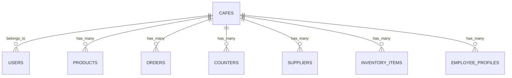
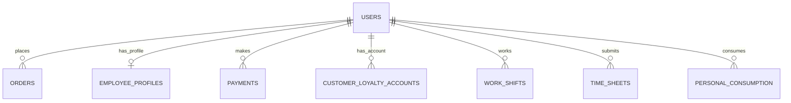
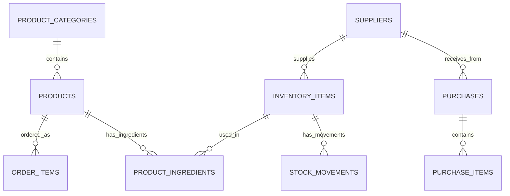
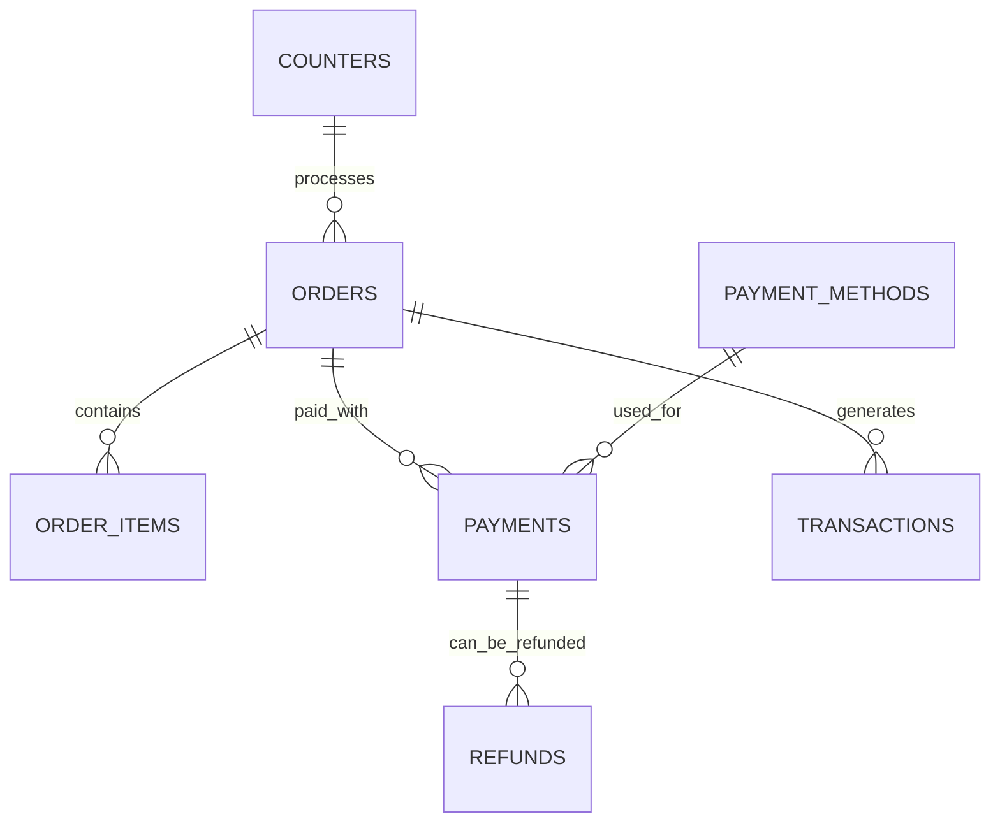
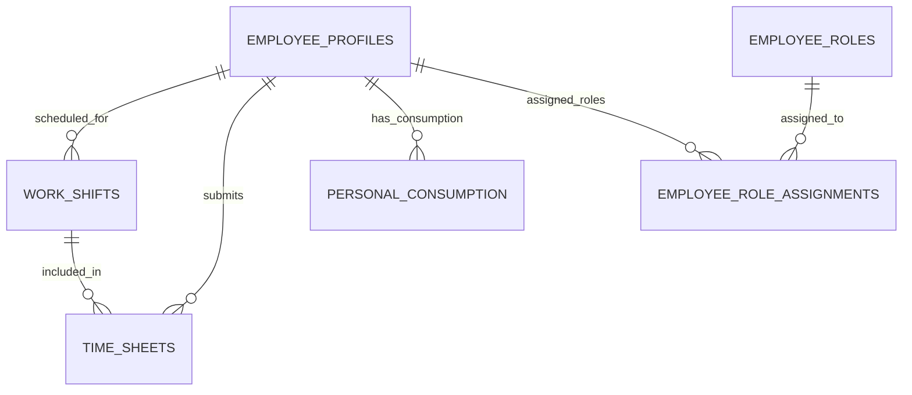
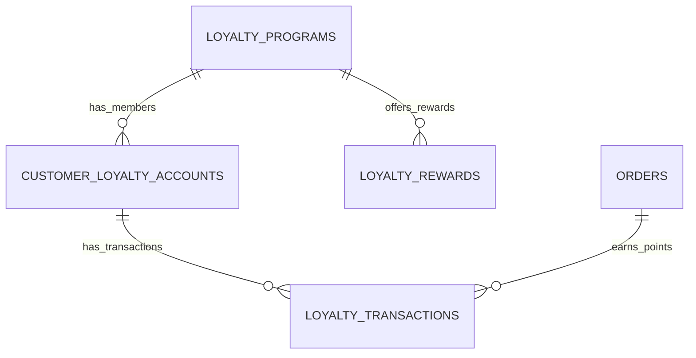

# Entity Relationship Diagram - Restaurant Ordering System

## Core Entity Relationships

### Multi-Tenant Architecture

### User Management

### Product & Inventory

### Order Processing

### Employee Management

### Loyalty & Rewards

## Detailed Entity Descriptions

### Core Entities

#### CAFES
- **Purpose**: Multi-tenant root entity
- **Key Relationships**:
  - Parent to all other entities (cafe_id foreign key)
  - Isolation boundary for data access
- **Business Rules**:
  - Each cafe operates independently
  - Data is partitioned by cafe_id
  - Subscription tier controls feature access

#### USERS
- **Purpose**: All system users (customers, employees, admins)
- **Key Relationships**:
  - Belongs to a cafe
  - Can have employee profile
  - Places orders and makes payments
- **Business Rules**:
  - Email must be unique across system
  - Role determines access permissions
  - GDPR consent required for data processing

#### PRODUCTS
- **Purpose**: Items available for sale
- **Key Relationships**:
  - Belongs to product category
  - Has ingredients from inventory
  - Ordered through order items
- **Business Rules**:
  - SKU unique within cafe
  - Pricing in cafe currency
  - Availability controlled by inventory

### Transaction Entities

#### ORDERS
- **Purpose**: Customer purchase requests
- **Key Relationships**:
  - Placed by user at counter
  - Contains multiple order items
  - Paid through payments
- **Business Rules**:
  - Order number unique within cafe
  - Status follows defined workflow
  - Total calculated from items + tax + tip

#### PAYMENTS
- **Purpose**: Financial transactions
- **Key Relationships**:
  - Pays for specific order
  - Uses payment method
  - Can be refunded
- **Business Rules**:
  - Amount must match order total
  - Fee calculated by payment method
  - Immutable once completed

#### TRANSACTIONS
- **Purpose**: Financial audit trail
- **Key Relationships**:
  - References payments and orders
  - Tracks all money movements
- **Business Rules**:
  - Complete audit trail required
  - Balance calculations tracked
  - Immutable financial records

### Inventory Entities

#### INVENTORY_ITEMS
- **Purpose**: Stock management
- **Key Relationships**:
  - Supplied by suppliers
  - Used in product recipes
  - Tracked through stock movements
- **Business Rules**:
  - Current stock = purchases - sales - waste
  - Reorder when below threshold
  - Cost tracking for profitability

#### STOCK_MOVEMENTS
- **Purpose**: Inventory transaction log
- **Key Relationships**:
  - References inventory items
  - Links to orders/purchases
- **Business Rules**:
  - All inventory changes logged
  - Positive for inbound, negative for outbound
  - Batch tracking for expiry management

### Employee Entities

#### EMPLOYEE_PROFILES
- **Purpose**: Extended employee information
- **Key Relationships**:
  - Links to user account
  - Has work shifts and timesheets
  - Assigned to roles
- **Business Rules**:
  - Employment dates tracked
  - Hourly rate for payroll
  - Emergency contacts required

#### WORK_SHIFTS
- **Purpose**: Employee schedule management
- **Key Relationships**:
  - Assigned to employee and counter
  - Aggregated into timesheets
- **Business Rules**:
  - Scheduled vs actual times tracked
  - Break time monitoring
  - Overtime calculation

## Data Flow Patterns

### Order Processing Flow
1. **Order Creation**: Customer/Employee creates order
2. **Item Selection**: Products added to order
3. **Inventory Check**: Stock verification and reservation
4. **Payment Processing**: Payment method execution
5. **Order Fulfillment**: Preparation and completion
6. **Inventory Update**: Stock movement recording
7. **Loyalty Points**: Customer rewards processing

### Inventory Management Flow
1. **Purchase Planning**: Reorder recommendations
2. **Purchase Orders**: Supplier order creation
3. **Goods Receipt**: Stock movement recording
4. **Quality Control**: Waste/damage tracking
5. **Usage Tracking**: Recipe-based consumption
6. **Reorder Triggers**: Automatic threshold monitoring

### Employee Management Flow
1. **Shift Scheduling**: Work shift assignments
2. **Time Tracking**: Actual work time recording
3. **Payroll Processing**: Timesheet aggregation
4. **Performance Monitoring**: Metrics calculation
5. **Personal Consumption**: Employee purchase tracking

## Database Constraints & Rules

### Foreign Key Relationships
- All entities reference cafes(id) for multi-tenancy
- Cascading deletes for dependent data
- Restrict deletes for critical references

### Check Constraints
- Monetary amounts must be non-negative
- Quantities must be logical (positive for purchases)
- Dates must be chronologically consistent
- Status values must be from allowed enums

### Unique Constraints
- Email addresses globally unique
- SKUs unique within cafe
- Order numbers unique within cafe
- Employee numbers unique within cafe

### Audit Requirements
- All financial transactions logged
- User actions tracked for security
- Data access logged for GDPR compliance
- Change history maintained for critical entities

## Performance Considerations

### Indexing Strategy
- Multi-column indexes for common query patterns
- Partial indexes for filtered queries
- Text search indexes for product/customer lookup
- Time-based partitioning for large tables

### Query Optimization
- Cafe-based data filtering at application level
- Prepared statements for common operations
- Connection pooling for high concurrency
- Read replicas for reporting queries

### Scaling Patterns
- Horizontal partitioning by cafe_id
- Archive old data based on retention policies
- Separate OLTP and OLAP workloads
- Cache frequently accessed reference data

This ERD provides a comprehensive view of the restaurant ordering system's data architecture, ensuring proper relationships, constraints, and business rule enforcement while maintaining scalability and performance.