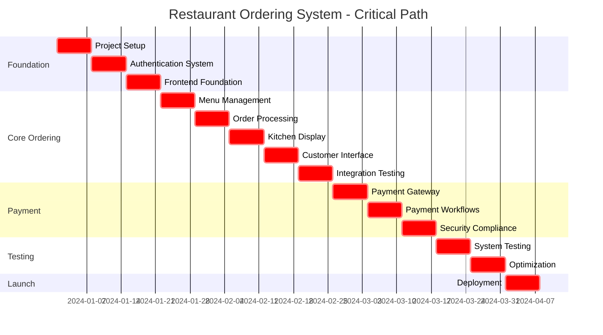
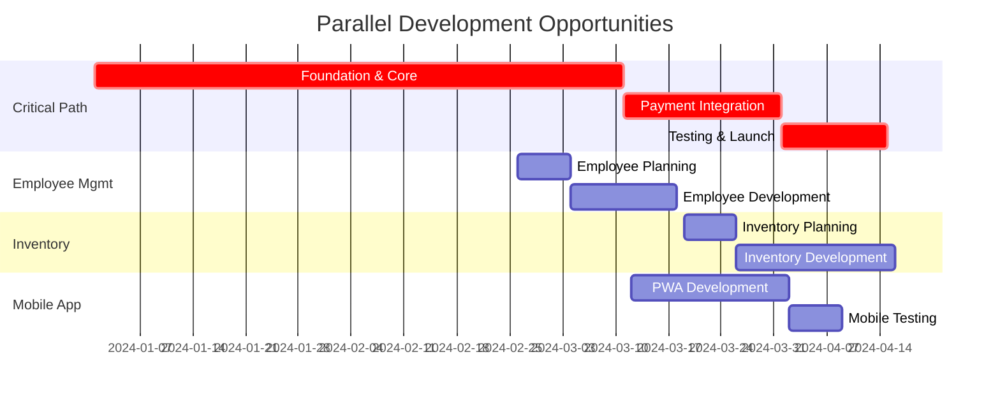

# Restaurant Ordering System - Project Timeline & Critical Path Analysis

## Project Timeline Overview

**Total Duration**: 21 weeks (147 days)
**Sprint Duration**: 2 weeks each
**Total Sprints**: 10.5 sprints
**Target Completion**: Q2 2025

## Critical Path Analysis

### Critical Path Dependencies (Must Complete in Sequence)

### Parallel Development Tracks

## Detailed Timeline by Phase

### Phase 1: Foundation Setup (Weeks 1-3) - CRITICAL PATH
**Duration**: 21 days
**Sprint 1-1.5**

#### Week 1 (Days 1-7): Project Infrastructure - CRITICAL
- **Dependencies**: None (project kickoff)
- **Deliverables**:
  - Development environment setup
  - CI/CD pipeline operational
  - Database schema designed
- **Critical Success Factors**:
  - Multi-tenant architecture foundation
  - Docker environment working for all team members
  - Database migrations functional

#### Week 2 (Days 8-14): Authentication & Core APIs - CRITICAL
- **Dependencies**: Week 1 completion (database schema)
- **Deliverables**:
  - JWT authentication system
  - Role-based access control
  - Multi-tenant API framework
- **Critical Success Factors**:
  - Authentication 100% functional
  - Tenant isolation verified
  - API security implemented

#### Week 3 (Days 15-21): Frontend Foundation - CRITICAL
- **Dependencies**: Week 2 completion (authentication APIs)
- **Deliverables**:
  - Next.js application with auth integration
  - Design system implementation
  - Responsive layout foundation
- **Critical Success Factors**:
  - Frontend-backend integration working
  - Authentication UI functional
  - Mobile-responsive design

### Phase 2: Core Ordering System (Weeks 4-8) - CRITICAL PATH
**Duration**: 35 days
**Sprint 2-4**

#### Week 4 (Days 22-28): Menu Management - CRITICAL
- **Dependencies**: Phase 1 completion (auth + frontend)
- **Deliverables**:
  - Menu CRUD operations
  - Category and item management
  - Image upload system
- **Critical Success Factors**:
  - Menu system handles complex hierarchies
  - Image upload optimized and secure
  - Admin interface intuitive

#### Week 5 (Days 29-35): Order Processing Engine - CRITICAL
- **Dependencies**: Week 4 completion (menu system)
- **Deliverables**:
  - Order creation and management
  - Real-time order updates
  - Order validation system
- **Critical Success Factors**:
  - WebSocket connections stable
  - Order processing handles edge cases
  - Real-time updates <100ms latency

#### Week 6 (Days 36-42): Kitchen Display System - CRITICAL
- **Dependencies**: Week 5 completion (order processing)
- **Deliverables**:
  - Kitchen dashboard with real-time updates
  - Order queue management
  - Preparation time tracking
- **Critical Success Factors**:
  - Kitchen display handles high order volume
  - Real-time updates never fail
  - Touch interface optimized for kitchen environment

#### Week 7 (Days 43-49): Customer Ordering Interface - CRITICAL
- **Dependencies**: Week 6 completion (kitchen system)
- **Deliverables**:
  - Customer-facing menu interface
  - Shopping cart and checkout
  - Order tracking system
- **Critical Success Factors**:
  - Customer experience intuitive and fast
  - Cart persistence works offline
  - Checkout process <30 seconds

#### Week 8 (Days 50-56): Integration & Testing - CRITICAL
- **Dependencies**: Week 7 completion (customer interface)
- **Deliverables**:
  - End-to-end order flow tested
  - Performance optimization
  - Bug fixes and stability improvements
- **Critical Success Factors**:
  - Full order flow works flawlessly
  - Performance meets benchmarks
  - System stable under load

### Phase 3: Payment Integration (Weeks 9-11) - CRITICAL PATH
**Duration**: 21 days
**Sprint 4.5-5.5**

#### Week 9 (Days 57-63): Payment Gateway Integration - CRITICAL
- **Dependencies**: Phase 2 completion (order system stable)
- **Deliverables**:
  - Stripe API integration
  - Payment processing system
  - Multi-currency support
- **Critical Success Factors**:
  - Payment processing 99.9% reliable
  - PCI compliance requirements met
  - Multiple payment methods supported

#### Week 10 (Days 64-70): Payment Workflows - CRITICAL
- **Dependencies**: Week 9 completion (payment gateway)
- **Deliverables**:
  - Order-payment integration
  - Refund and cancellation system
  - Payment administration
- **Critical Success Factors**:
  - Payment-order integration seamless
  - Refund process automated
  - Payment disputes handled properly

#### Week 11 (Days 71-77): Security & Compliance - CRITICAL
- **Dependencies**: Week 10 completion (payment workflows)
- **Deliverables**:
  - PCI DSS compliance verified
  - Security audit completed
  - Fraud detection implemented
- **Critical Success Factors**:
  - Security audit passes with no critical issues
  - PCI compliance certification obtained
  - Fraud detection reduces false positives

### Phase 4: Employee Management (Weeks 12-14) - PARALLEL TRACK
**Duration**: 21 days
**Sprint 6-7**
**Can start after Week 11 (payment security complete)**

#### Week 12 (Days 78-84): Employee Administration - PARALLEL
- **Dependencies**: Phase 1 completion (auth system)
- **Parallel with**: Payment security finalization
- **Deliverables**:
  - Employee profile management
  - Role and permission system
  - Employee onboarding workflow

#### Week 13 (Days 85-91): Scheduling System - PARALLEL
- **Dependencies**: Week 12 completion
- **Deliverables**:
  - Shift scheduling interface
  - Availability management
  - Time tracking integration

#### Week 14 (Days 92-98): Performance & Communication - PARALLEL
- **Dependencies**: Week 13 completion
- **Deliverables**:
  - Performance metrics tracking
  - Employee communication system
  - Mobile employee access

### Phase 5: Inventory Management (Weeks 15-18) - PARALLEL TRACK
**Duration**: 28 days
**Sprint 7.5-9**
**Can start after Week 12 (employee foundation complete)**

#### Week 15 (Days 99-105): Inventory Foundation - PARALLEL
- **Dependencies**: Phase 1 completion (database + auth)
- **Parallel with**: Employee management completion
- **Deliverables**:
  - Inventory item management
  - Stock level tracking
  - Multi-location support

#### Week 16 (Days 106-112): Supply Chain Management - PARALLEL
- **Dependencies**: Week 15 completion
- **Deliverables**:
  - Supplier management system
  - Purchase order system
  - Quality control workflows

#### Week 17 (Days 113-119): Automated Systems - PARALLEL
- **Dependencies**: Week 16 completion
- **Deliverables**:
  - Automatic reordering
  - Waste management
  - POS system integration

#### Week 18 (Days 120-126): Analytics & Reporting - PARALLEL
- **Dependencies**: Week 17 completion
- **Deliverables**:
  - Inventory analytics dashboard
  - Financial reporting
  - Performance optimization

### Phase 6: Mobile App Development (Weeks 16-18) - PARALLEL TRACK
**Duration**: 21 days
**Sprint 8-9**
**Can start after Week 8 (core ordering complete)**

#### Week 16 (Days 106-112): PWA Foundation - PARALLEL
- **Dependencies**: Phase 2 completion (core ordering system)
- **Parallel with**: Inventory supply chain management
- **Deliverables**:
  - Service worker implementation
  - Mobile-optimized UI
  - Offline capabilities

#### Week 17 (Days 113-119): Mobile Features - PARALLEL
- **Dependencies**: Week 16 completion
- **Deliverables**:
  - Push notifications
  - Device integration
  - Mobile payment optimization

#### Week 18 (Days 120-126): Mobile Testing & Optimization - PARALLEL
- **Dependencies**: Week 17 completion
- **Deliverables**:
  - Cross-device testing
  - App store preparation
  - Performance optimization

### Phase 7: Testing & Optimization (Weeks 19-20) - CRITICAL PATH
**Duration**: 14 days
**Sprint 9.5-10**

#### Week 19 (Days 127-133): System Integration Testing - CRITICAL
- **Dependencies**: All previous phases 80% complete
- **Deliverables**:
  - Full system integration testing
  - Load and stress testing
  - Security penetration testing
- **Critical Success Factors**:
  - System handles expected load
  - Security vulnerabilities resolved
  - Integration points stable

#### Week 20 (Days 134-140): Optimization & Finalization - CRITICAL
- **Dependencies**: Week 19 completion
- **Deliverables**:
  - Performance optimization
  - Bug fixing and refinement
  - Documentation completion
- **Critical Success Factors**:
  - All critical bugs resolved
  - Performance meets SLA requirements
  - Documentation complete and accurate

### Phase 8: Deployment & Launch (Week 21) - CRITICAL PATH
**Duration**: 7 days
**Sprint 10.5**

#### Week 21 (Days 141-147): Production Launch - CRITICAL
- **Dependencies**: Phase 7 completion (all testing passed)
- **Deliverables**:
  - Production deployment
  - Monitoring setup
  - Go-live support
- **Critical Success Factors**:
  - Zero-downtime deployment
  - All monitoring systems operational
  - Support team ready and trained

## Critical Path Risk Analysis

### High-Risk Critical Path Items

#### 1. Week 5: Order Processing Engine (Days 29-35)
**Risk Level**: HIGH
**Impact**: Delays entire project by 1-2 weeks
**Mitigation Strategies**:
- Assign senior developer with WebSocket experience
- Start WebSocket proof of concept in Week 4
- Have backup messaging solution ready (Redis pub/sub)
- Daily progress reviews during this week

#### 2. Week 9-11: Payment Integration (Days 57-77)
**Risk Level**: VERY HIGH
**Impact**: Could delay launch by 2-4 weeks
**Mitigation Strategies**:
- Begin Stripe integration research in Week 6
- Engage security consultant early
- Plan for parallel PCI compliance work
- Have fallback to simpler payment method

#### 3. Week 19: System Integration Testing (Days 127-133)
**Risk Level**: HIGH
**Impact**: Could reveal fundamental integration issues
**Mitigation Strategies**:
- Continuous integration testing throughout development
- Weekly integration checkpoints
- Have dedicated testing environment ready
- Plan for parallel bug fixing team

### Critical Path Optimization Strategies

#### Parallel Work Opportunities
1. **Employee Management (Weeks 12-14)** can be developed while payment security is being finalized
2. **Inventory Management (Weeks 15-18)** can be developed independently after basic auth is complete
3. **Mobile App (Weeks 16-18)** can be developed as soon as core ordering system is stable

#### Buffer Time Allocation
- **Week 8**: Built-in buffer for core ordering system issues
- **Week 14**: Buffer for payment integration complexity
- **Week 20**: Buffer for final testing and bug fixes

#### Fast-Track Options
If ahead of schedule:
- Advance mobile app development to start in Week 14
- Begin inventory management in Week 13
- Add extra testing week before launch

## Resource Critical Path

### Critical Skills on Critical Path

#### Weeks 1-8: Core Development Team
- **Backend Architect** (Weeks 1-11): Critical for authentication, ordering, and payment systems
- **Senior Full-Stack Developer** (Weeks 2-8): Critical for frontend-backend integration
- **DevOps Engineer** (Weeks 1, 19-21): Critical for setup and deployment

#### Weeks 9-11: Payment Specialists
- **Payment Integration Developer**: Essential for Stripe integration
- **Security Consultant**: Required for PCI compliance
- **QA Engineer with payment experience**: Critical for payment testing

#### Weeks 19-21: Testing and Launch Team
- **Performance Engineer**: Critical for load testing
- **Security Tester**: Essential for penetration testing
- **DevOps Engineer**: Critical for production deployment

### Resource Availability Risks

#### High-Risk Scenarios
1. **Payment developer unavailable**: Could delay critical path by 2-3 weeks
2. **Security consultant scheduling**: PCI compliance cannot be delayed
3. **DevOps engineer overloaded**: Deployment risks increase significantly

#### Mitigation Strategies
1. Identify backup payment developers early
2. Schedule security consultant in advance with contract
3. Cross-train team members on deployment procedures
4. Have managed deployment service as backup

## Timeline Contingency Plans

### Plan A: On Schedule (Base Timeline)
- All phases complete as outlined
- Launch on Day 147 (Week 21)
- Full feature set delivered

### Plan B: 2-Week Delay Scenario
**Trigger**: Critical path delayed by payment integration complexity
**Response**:
- Extend timeline to Week 23
- Parallel inventory and employee management continue
- Reduce scope of advanced payment features
- Delay non-critical integrations

### Plan C: 4-Week Delay Scenario
**Trigger**: Major integration issues discovered in testing
**Response**:
- Extend timeline to Week 25
- Launch with reduced feature set
- Employee management Phase 2 delivery
- Inventory management basic features only
- Mobile app launch delayed 2 weeks

### Plan D: Emergency Minimum Viable Product
**Trigger**: Major technical issues or resource unavailability
**Response**:
- Launch basic ordering system by Week 19
- Core features only: menu, orders, basic payments
- Employee and inventory management post-launch
- Mobile web app instead of native features

## Success Metrics by Timeline

### Week 8 Success Criteria
- [ ] Complete order flow from customer to kitchen working
- [ ] Real-time updates functional with <100ms latency
- [ ] System handles 100 concurrent orders
- [ ] 95% test coverage on core ordering features

### Week 11 Success Criteria
- [ ] Payment processing functional with Stripe
- [ ] PCI compliance audit passed
- [ ] Refund workflows operational
- [ ] 99.9% payment success rate in testing

### Week 18 Success Criteria
- [ ] All parallel tracks (Employee, Inventory, Mobile) at 90% completion
- [ ] Integration points between systems tested
- [ ] Performance benchmarks met on all subsystems

### Week 20 Success Criteria
- [ ] Full system integration complete
- [ ] Load testing passed (10,000+ concurrent users)
- [ ] Security audit passed with no critical issues
- [ ] All documentation complete

### Week 21 Success Criteria
- [ ] Production deployment successful
- [ ] Zero critical bugs in first 24 hours
- [ ] All monitoring systems operational
- [ ] Customer onboarding process smooth

## Communication & Reporting Schedule

### Daily Standups
- Focus on critical path progress
- Identify blockers immediately
- Resource reallocation decisions

### Weekly Progress Reviews
- Critical path milestone assessment
- Risk review and mitigation updates
- Resource needs for upcoming week
- Timeline adjustment decisions

### Bi-weekly Sprint Reviews
- Demo critical path functionality
- Stakeholder feedback on progress
- Sprint planning for critical path items
- Risk escalation to leadership

### Monthly Executive Updates
- Overall timeline status
- Critical path risk assessment
- Resource needs and budget impact
- Strategic decision requirements

This timeline provides a clear view of the critical path while maximizing parallel development opportunities to deliver the restaurant ordering system on schedule with manageable risk.