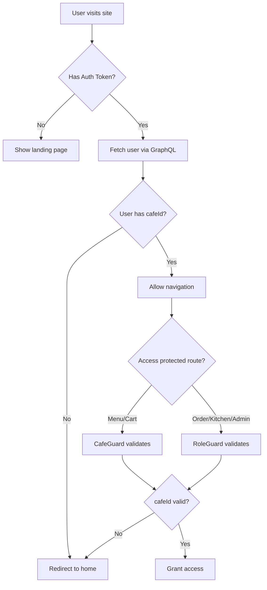

# Cafe Loading Architecture

## Overview

This document describes the multi-tenant cafe loading architecture that ensures users cannot navigate beyond the landing page without a properly loaded `cafeId`.

## Critical Requirement

**Users can NEVER access protected routes without a valid `cafeId` loaded in their session.**

## Loading Mechanisms

### 1. Environment Variables (Future Enhancement)

Environment variables can be used to set a default cafe ID:

```env
NEXT_PUBLIC_CAFE_ID=uuid-of-default-cafe
```

**Status:** Not yet implemented
**Priority:** Low

### 2. Hostname-based Detection (Future Enhancement)

Cafe can be detected from subdomain or hostname:

```
cafe-name.tabletap.com → Load cafe by slug "cafe-name"
localhost:3000 → Load from environment variable
```

**Status:** Not yet implemented
**Priority:** Medium

### 3. User Model (Current Implementation)

**Primary Method:** Every authenticated user has a `cafeId` field that determines their cafe membership.

**Database Schema:**
```typescript
@Entity('Users')
class User {
  @Column('uuid')
  @Index()
  cafeId: string;

  @ManyToOne(() => Cafe)
  cafe: Cafe;
}
```

**GraphQL Query:**
```graphql
query {
  me {
    id
    firstName
    lastName
    role
    cafeId  # ← CRITICAL: Must be included
  }
}
```

## Validation Guards

### CafeGuard

**Location:** [libs/frontend/modules/auth/guard/src/lib/cafe.guard.ts](libs/frontend/modules/auth/guard/src/lib/cafe.guard.ts)

**Purpose:** Validates that a user has a valid `cafeId` before accessing protected routes.

**Validation Logic:**

1. ✅ User is authenticated
2. ✅ User has a valid ID
3. ✅ **User has a non-null cafeId**

**Redirects:**
- No authentication → `/auth/login`
- No cafeId → `/` (home page)

**Example Usage:**

```typescript
// Cafe required only (menu, cart)
{
  path: 'menu',
  loadChildren: () => import('./menu'),
  canActivate: [CafeGuard],
}

// Cafe + Role required (order, kitchen, admin)
{
  path: 'order',
  loadChildren: () => import('./order'),
  canActivate: [CafeGuard, RoleGuard],
  data: { roles: ['customer'] }
}
```

### RoleGuard

**Location:** [libs/frontend/modules/auth/guard/src/lib/role.guard.ts](libs/frontend/modules/auth/guard/src/lib/role.guard.ts)

**Purpose:** Validates user role for role-protected routes.

**Validation Logic:**

1. ✅ User is authenticated
2. ✅ User has a valid ID
3. ✅ User has required role

**Redirects:**
- No authentication → `/auth/login`
- Wrong role → Specified redirect or `/`

**Note:** When cafe validation is also required, use `canActivate: [CafeGuard, RoleGuard]` to compose both guards.

## Route Protection Matrix

| Route | Guards | Cafe Required | Role Required |
|-------|--------|---------------|---------------|
| `/` (home) | None | ❌ No | ❌ No |
| `/auth/*` | None | ❌ No | ❌ No |
| `/menu` | `[CafeGuard]` | ✅ Yes | ❌ No |
| `/cart` | `[CafeGuard]` | ✅ Yes | ❌ No |
| `/order/*` | `[CafeGuard, RoleGuard]` | ✅ Yes | ✅ customer |
| `/kitchen/*` | `[CafeGuard, RoleGuard]` | ✅ Yes | ✅ kitchen_staff, admin |
| `/admin/*` | `[CafeGuard, RoleGuard]` | ✅ Yes | ✅ admin |

**Note:** Routes requiring both cafe and role validation use both guards explicitly for clarity and easier maintenance.

## Backend GraphQL Context

**Location:** [libs/backend/graphql/src/graphql.module.ts](libs/backend/graphql/src/graphql.module.ts#L144)

**Context Enhancement:**

```typescript
context: ({ req }) => {
  const user = req?.user;
  const cafeId = user?.cafeId;

  return {
    req,
    user,
    cafeId,  // ← Available to all resolvers
  };
}
```

**Benefits:**
- All resolvers can access `context.cafeId`
- Automatic cafe scoping for queries
- Reduced boilerplate in resolvers

## Server-Side Validation

### RoleBasedAccessGuard

**Location:** [libs/backend/graphql/src/middleware/role-access-control.middleware.ts](libs/backend/graphql/src/middleware/role-access-control.middleware.ts)

**Decorators:**
- `@RequireCafeAccess()` - Validates user has access to the cafe in the request
- `@RequireRole()` - Validates user has required role
- `@Public()` - Bypasses authentication

**Example Usage:**
```typescript
@Resolver()
export class MenuResolver {
  @Query()
  @RequireCafeAccess()  // ← Validates cafeId matches user's cafe
  async menu(@Args('cafeId') cafeId: string, @Context() ctx) {
    // cafeId is validated before this runs
    return await Menu.find({ where: { cafeId } });
  }
}
```

## Authentication Flow



## Security Considerations

### Client-Side

1. **AuthService fetches cafeId** in the `me` query
2. **Guards validate cafeId** before route activation
3. **Redirects prevent access** without cafe context

### Server-Side

1. **JWT middleware** loads user from database (including cafeId)
2. **GraphQL context** provides cafeId to all resolvers
3. **@RequireCafeAccess** validates cafe ownership on mutations/queries
4. **Database relations** enforce referential integrity

## Common Pitfalls

### ❌ DON'T: Skip cafeId in GraphQL queries

```typescript
// BAD - Missing cafeId
query {
  me {
    id
    role
  }
}
```

### ✅ DO: Always include cafeId

```typescript
// GOOD
query {
  me {
    id
    role
    cafeId  // ← Essential
  }
}
```

### ❌ DON'T: Create unprotected routes for cafe-specific features

```typescript
// BAD - No guard
{
  path: 'menu',
  loadChildren: () => import('./menu'),
}
```

### ✅ DO: Protect all cafe-specific routes

```typescript
// GOOD
{
  path: 'menu',
  loadChildren: () => import('./menu'),
  canActivate: [CafeGuard],  // ← Enforces cafe loading
}
```

### ❌ DON'T: Trust client-provided cafeId in mutations

```typescript
// BAD - Trusts client
@Mutation()
async createOrder(@Args('cafeId') cafeId: string) {
  // Anyone can pass any cafeId!
}
```

### ✅ DO: Use context cafeId or validate access

```typescript
// GOOD
@Mutation()
@RequireCafeAccess()
async createOrder(
  @Args('cafeId') cafeId: string,
  @Context() ctx
) {
  // cafeId is validated before this runs
  // or use ctx.cafeId from authenticated user
}
```

## Future Enhancements

### 1. Hostname-based Cafe Detection

**Priority:** Medium

**Implementation:**

```typescript
// libs/frontend/utils/cafe-detection.util.ts
export function detectCafeFromHostname(): string | null {
  if (typeof window === 'undefined') return null;

  const hostname = window.location.hostname;

  // Extract subdomain
  const parts = hostname.split('.');
  if (parts.length >= 3) {
    const subdomain = parts[0];
    return subdomain; // cafe slug
  }

  return null;
}
```

### 2. Environment Variable Fallback

**Priority:** Low

**Implementation:**

```typescript
// apps/app/src/environments/environment.ts
export const environment = {
  production: false,
  defaultCafeId: process.env['NEXT_PUBLIC_CAFE_ID'] || null,
};
```

### 3. Multi-Cafe User Support

**Priority:** Low (requires database schema changes)

**Concept:** Allow users to belong to multiple cafes and switch between them.

```typescript
@Entity('Users')
class User {
  @Column('uuid', { nullable: true })
  currentCafeId: string;  // Active cafe

  @ManyToMany(() => Cafe)
  cafes: Cafe[];  // All cafes user belongs to
}
```

## Testing Checklist

- [ ] User without cafeId cannot access /menu
- [ ] User without cafeId cannot access /cart
- [ ] User without cafeId cannot access /order
- [ ] User with cafeId can access /menu
- [ ] User with cafeId can access /cart
- [ ] RoleGuard validates cafeId in addition to role
- [ ] GraphQL context includes cafeId
- [ ] Server-side guards validate cafe ownership

## Related Files

### Frontend
- [apps/app/config/app.routes.ts](apps/app/config/app.routes.ts) - Route definitions
- [libs/frontend/modules/auth/service/src/auth.service.ts](libs/frontend/modules/auth/service/src/auth.service.ts) - AuthService
- [libs/frontend/modules/auth/guard/src/lib/cafe.guard.ts](libs/frontend/modules/auth/guard/src/lib/cafe.guard.ts) - CafeGuard
- [libs/frontend/modules/auth/guard/src/lib/role.guard.ts](libs/frontend/modules/auth/guard/src/lib/role.guard.ts) - RoleGuard

### Backend
- [libs/backend/graphql/src/graphql.module.ts](libs/backend/graphql/src/graphql.module.ts) - GraphQL configuration
- [libs/backend/graphql/src/middleware/role-access-control.middleware.ts](libs/backend/graphql/src/middleware/role-access-control.middleware.ts) - Server-side guards
- [libs/models/models/src/models/core/user/user.model.ts](libs/models/models/src/models/core/user/user.model.ts) - User model

## Summary

The cafe loading architecture ensures multi-tenant data isolation by:

1. ✅ **Storing cafeId** in the User model
2. ✅ **Fetching cafeId** in the auth query
3. ✅ **Validating cafeId** via guards on protected routes
4. ✅ **Providing cafeId** in GraphQL context
5. ✅ **Enforcing cafe access** at the resolver level

**Bottom line:** Users can browse the landing page, but cannot access menu, cart, orders, kitchen, or admin features without a valid cafeId.
