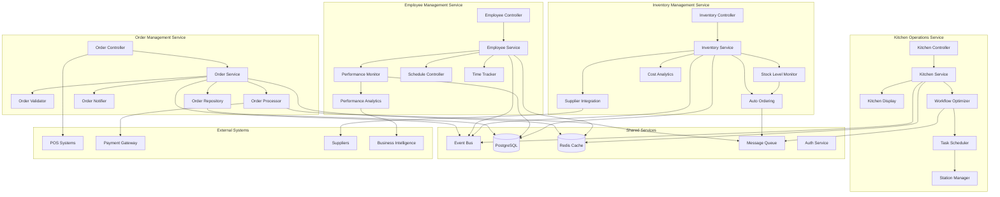
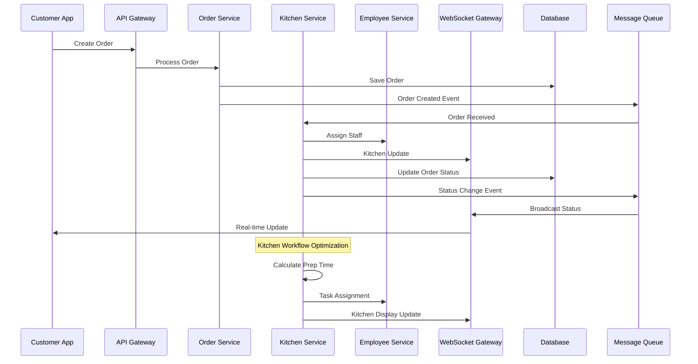
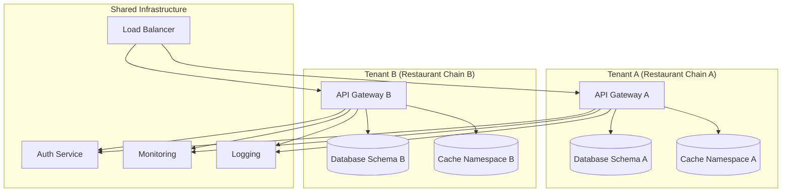

# TableTap Component Architecture Diagram

## C4 Model - Component Level (Level 3)

### Order Management Service Components

## Data Flow Architecture

### Real-Time Order Processing Flow

## Multi-Tenant Architecture

### Tenant Isolation Strategy

This component architecture provides a detailed view of how each service is structured internally and how they interact with each other and external systems.