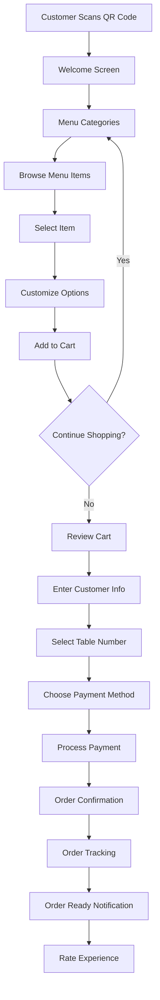
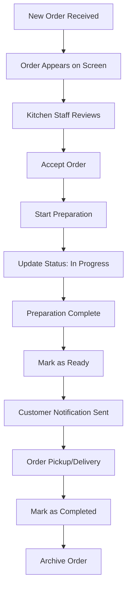
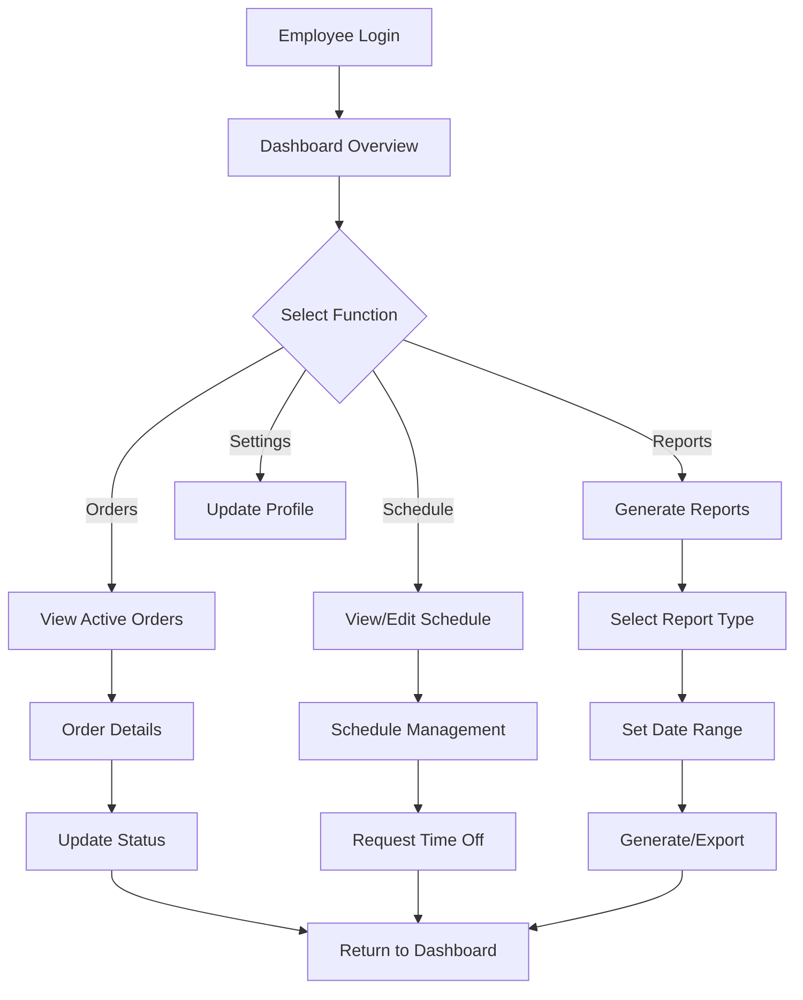
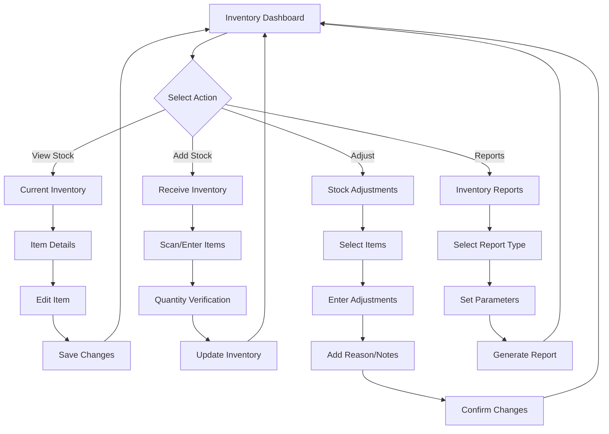
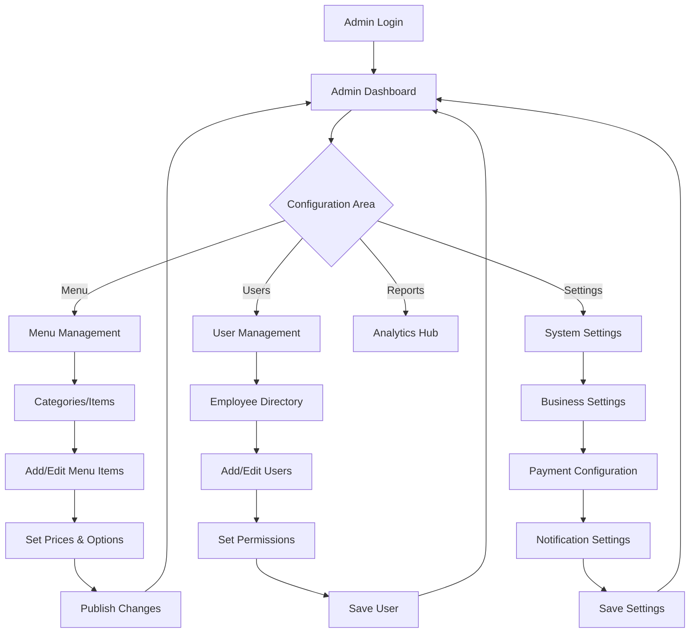
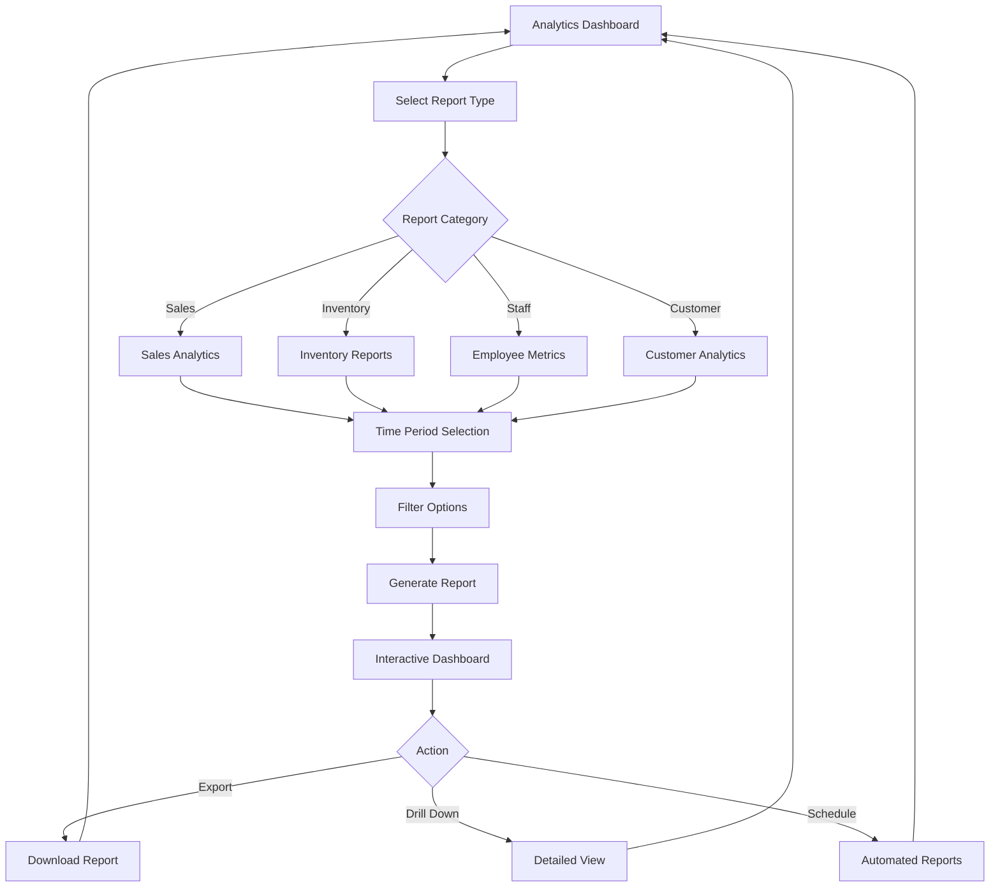
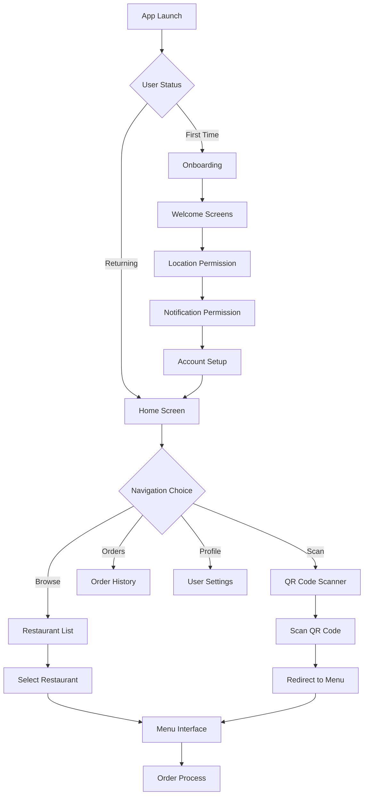

# User Flow Diagrams - Table Tap Restaurant Ordering System

## 1. Customer Ordering Flow (Web/Mobile)

### Primary Flow: Dine-In Order

### Alternative Flows:
- **Takeout/Delivery**: Skip table selection, add address/pickup time
- **Guest Checkout**: Minimal information required
- **Returning Customer**: Auto-fill customer information

## 2. Counter/Kitchen Display Flow

### Order Processing Flow

### Priority Management:
- VIP orders highlighted
- Time-based color coding
- Special dietary requirements flagged

## 3. Employee Management Dashboard Flow

### Daily Operations Flow

## 4. Inventory Management Flow

### Stock Management Flow

### Low Stock Alerts:
- Automated notifications
- Suggested reorder quantities
- Supplier contact integration

## 5. Admin Configuration Flow

### System Setup Flow

## 6. Analytics Dashboard Flow

### Reporting Flow

## 7. Mobile App Flow (Capacitor)

### App Launch Flow

## Cross-Platform Considerations

### Responsive Breakpoints:
- **Mobile (< 640px)**: Single column, bottom navigation
- **Tablet (640px - 1024px)**: Two columns, side navigation
- **Desktop (> 1024px)**: Multi-column, top navigation

### Touch Interactions:
- Swipe gestures for navigation
- Pull-to-refresh on mobile
- Long press for context menus
- Pinch-to-zoom for detailed views

### Offline Capabilities:
- Cache critical data
- Queue orders when offline
- Sync when connection restored
- Offline indicator in UI

## Error Handling Flows

### Common Error Scenarios:
1. **Payment Failure**: Retry options, alternative payment methods
2. **Network Issues**: Offline mode, retry mechanisms
3. **Out of Stock**: Alternative suggestions, waitlist options
4. **Invalid Input**: Clear error messages, correction guidance

### Recovery Patterns:
- Auto-save draft orders
- Session restoration
- Graceful degradation
- User-friendly error messages

These user flows ensure intuitive navigation and efficient task completion across all system interfaces while maintaining consistency in user experience patterns.