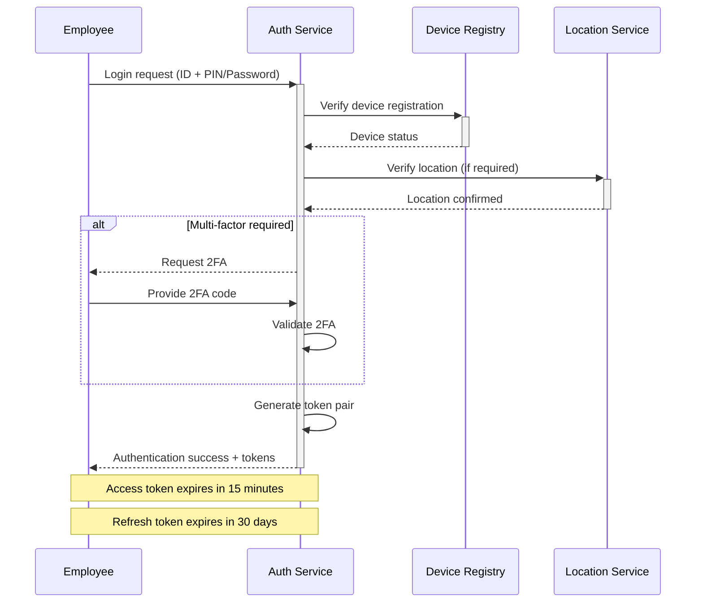
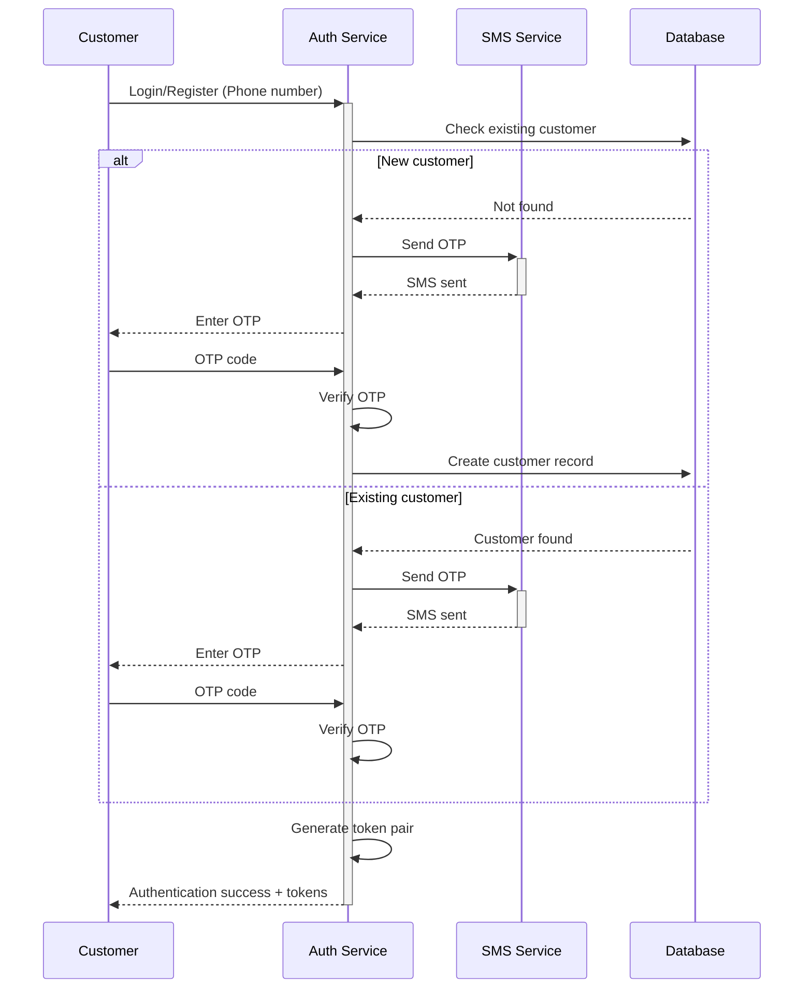

# Security Requirements & Authentication Flows

## Overview

This document defines comprehensive security requirements, authentication flows, authorization mechanisms, and security controls for the Restaurant Ordering System. All specifications comply with PCI DSS, GDPR, and industry security best practices.

## 1. Authentication Architecture

### 1.1 Multi-Factor Authentication System

```typescript
interface AuthenticationFlow {
  primary: 'password' | 'pin' | 'nfc_badge';
  secondary?: 'totp' | 'sms' | 'email';
  biometric?: 'fingerprint' | 'face';
  deviceTrust: boolean;
  locationVerification: boolean;
}

interface AuthenticationRequest {
  identifier: string;           // Email, employee ID, or NFC badge
  credential: string;           // Password, PIN, or biometric hash
  secondFactor?: string;        // TOTP, SMS code
  deviceId: string;
  location?: GeolocationData;
  cafeId: string;
  timestamp: Date;
}
```

### 1.2 JWT Token Architecture

```typescript
interface JWTPayload {
  sub: string;                  // User ID
  iss: 'table-tap-auth';       // Issuer
  aud: string;                  // Audience (cafe_id)
  iat: number;                  // Issued at
  exp: number;                  // Expires at
  nbf: number;                  // Not before

  // Custom claims
  role: UserRole;
  permissions: string[];
  cafeId: string;
  sessionId: string;
  deviceId: string;
  securityLevel: 1 | 2 | 3;    // Security clearance level
}

interface TokenPair {
  accessToken: string;          // Short-lived (15 minutes)
  refreshToken: string;         // Long-lived (30 days)
  tokenType: 'Bearer';
  expiresIn: number;
  scope: string;
}
```

### 1.3 Role-Based Access Control (RBAC)

```typescript
enum UserRole {
  CUSTOMER = 'customer',
  EMPLOYEE = 'employee',
  BARISTA = 'barista',
  CASHIER = 'cashier',
  SHIFT_MANAGER = 'shift_manager',
  CAFE_MANAGER = 'cafe_manager',
  REGIONAL_MANAGER = 'regional_manager',
  ADMIN = 'admin',
  SYSTEM = 'system'
}

interface Permission {
  resource: string;             // orders, payments, employees, etc.
  action: string;               // create, read, update, delete
  conditions?: PermissionCondition[];
}

interface PermissionCondition {
  field: string;                // ownerId, cafeId, status
  operator: 'eq' | 'in' | 'gt' | 'lt';
  value: any;
}
```

### 1.4 Permission Matrix

| Role | Orders | Payments | Menu | Employees | Analytics | System |
|------|--------|----------|------|-----------|-----------|---------|
| Customer | Own:CRUD | Own:Create | Read | - | Own:Read | - |
| Employee | Assigned:CRUD | Cash:Create | Read | Own:Read | - | - |
| Barista | Counter:CRUD | Cash:Create | Read | Own:Read | Counter:Read | - |
| Cashier | All:CRUD | All:Create | Read | Own:Read | Counter:Read | - |
| Shift Manager | Cafe:CRUD | All:CRUD | Update | Shift:CRUD | Cafe:Read | Limited |
| Cafe Manager | Cafe:CRUD | All:CRUD | CRUD | Cafe:CRUD | Cafe:CRUD | Cafe:Update |
| Regional Manager | Region:CRUD | Region:Read | Region:Read | Region:CRUD | Region:CRUD | Region:Update |
| Admin | All:CRUD | All:CRUD | All:CRUD | All:CRUD | All:CRUD | All:CRUD |

## 2. Authentication Flows

### 2.1 Employee Authentication Flow



### 2.2 Customer Authentication Flow



### 2.3 NFC Badge Authentication

```typescript
interface NFCAuthentication {
  badgeId: string;              // Unique NFC badge identifier
  employeeId: string;
  lastUsed: Date;
  isActive: boolean;
  securityLevel: number;
  associatedDevices: string[];  // Authorized devices
}

// NFC Authentication Flow
const authenticateNFC = async (
  badgeId: string,
  deviceId: string,
  location?: GeolocationData
): Promise<AuthenticationResult> => {
  // 1. Validate badge
  const badge = await validateNFCBadge(badgeId);
  if (!badge.isActive) throw new Error('BADGE_INACTIVE');

  // 2. Verify device authorization
  if (!badge.associatedDevices.includes(deviceId)) {
    throw new Error('DEVICE_NOT_AUTHORIZED');
  }

  // 3. Location verification (if required)
  if (location && badge.securityLevel >= 2) {
    await verifyLocationAccess(badge.employeeId, location);
  }

  // 4. Generate session tokens
  return generateTokenPair(badge.employeeId, badge.securityLevel);
};
```

## 3. Authorization Mechanisms

### 3.1 Attribute-Based Access Control (ABAC)

```typescript
interface AccessControlDecision {
  subject: {
    userId: string;
    role: UserRole;
    attributes: Record<string, any>;
  };
  resource: {
    type: string;
    id: string;
    attributes: Record<string, any>;
  };
  action: string;
  context: {
    time: Date;
    location: string;
    cafeId: string;
    ipAddress: string;
  };
}

const evaluateAccess = (decision: AccessControlDecision): boolean => {
  // Policy evaluation engine
  const policies = getPoliciesForResource(decision.resource.type);

  return policies.every(policy => {
    return evaluatePolicy(policy, decision);
  });
};
```

### 3.2 Dynamic Permission Evaluation

```typescript
// Policy examples
const orderAccessPolicy: AccessPolicy = {
  resource: 'order',
  conditions: [
    {
      // Customers can only access their own orders
      when: 'subject.role === "customer"',
      allow: 'resource.customerId === subject.userId'
    },
    {
      // Employees can access orders assigned to their counter
      when: 'subject.role === "employee"',
      allow: 'resource.counterId in subject.assignedCounters'
    },
    {
      // Managers can access all orders in their cafe
      when: 'subject.role === "manager"',
      allow: 'resource.cafeId === subject.cafeId'
    }
  ]
};
```

### 3.3 Session Management

```typescript
interface UserSession {
  sessionId: string;
  userId: string;
  deviceId: string;
  ipAddress: string;
  userAgent: string;
  createdAt: Date;
  lastActivity: Date;
  expiresAt: Date;
  securityLevel: number;

  // Session attributes
  cafeId: string;
  counterId?: string;
  isElevated: boolean;        // For sensitive operations
  maxIdleTime: number;        // Auto-logout after inactivity
}

// Session timeout based on role
const getSessionTimeout = (role: UserRole): number => {
  switch (role) {
    case UserRole.CUSTOMER: return 24 * 60 * 60; // 24 hours
    case UserRole.EMPLOYEE: return 8 * 60 * 60;  // 8 hours
    case UserRole.MANAGER: return 12 * 60 * 60;  // 12 hours
    case UserRole.ADMIN: return 4 * 60 * 60;     // 4 hours
    default: return 1 * 60 * 60;                 // 1 hour
  }
};
```

## 4. Data Protection & Encryption

### 4.1 Encryption Standards

```typescript
interface EncryptionConfig {
  // Data at rest
  databaseEncryption: {
    algorithm: 'AES-256-GCM';
    keyRotation: '90days';
    keyManagement: 'AWS-KMS' | 'Azure-KeyVault' | 'HashiCorp-Vault';
  };

  // Data in transit
  tlsConfig: {
    version: 'TLS-1.3';
    cipherSuites: [
      'TLS_AES_256_GCM_SHA384',
      'TLS_CHACHA20_POLY1305_SHA256'
    ];
  };

  // Application level encryption
  sensitiveFields: {
    algorithm: 'AES-256-CBC';
    keyDerivation: 'PBKDF2';
    saltLength: 32;
  };
}
```

### 4.2 PII Data Handling

```typescript
interface PIIField {
  field: string;
  classification: 'public' | 'internal' | 'confidential' | 'restricted';
  encryption: boolean;
  masking: boolean;
  retention: number; // days
  access: UserRole[];
}

const piiMapping: PIIField[] = [
  {
    field: 'customer.email',
    classification: 'confidential',
    encryption: true,
    masking: true,
    retention: 2555, // 7 years
    access: [UserRole.CUSTOMER, UserRole.MANAGER, UserRole.ADMIN]
  },
  {
    field: 'customer.phone',
    classification: 'confidential',
    encryption: true,
    masking: true,
    retention: 2555,
    access: [UserRole.CUSTOMER, UserRole.MANAGER, UserRole.ADMIN]
  },
  {
    field: 'payment.cardNumber',
    classification: 'restricted',
    encryption: true,
    masking: true,
    retention: 0, // Never stored - tokenized only
    access: []
  }
];
```

### 4.3 Key Management

```typescript
interface KeyManagementSystem {
  masterKey: string;           // Hardware Security Module (HSM)
  dataKeys: Map<string, string>; // Data encryption keys
  keyVersions: Map<string, number>;

  rotateKey(keyId: string): Promise<void>;
  encryptData(data: string, keyId: string): Promise<string>;
  decryptData(encryptedData: string, keyId: string): Promise<string>;

  // Automated key rotation
  rotationSchedule: {
    masterKey: '1year';
    dataKeys: '90days';
    signingKeys: '30days';
  };
}
```

## 5. Security Controls

### 5.1 Rate Limiting

```typescript
interface RateLimitConfig {
  authentication: {
    window: '15min';
    maxAttempts: 5;
    blockDuration: '30min';
    progressivePenalty: boolean;
  };

  api: {
    perUser: {
      window: '1min';
      maxRequests: 100;
    };
    perIP: {
      window: '1min';
      maxRequests: 200;
    };
  };

  payment: {
    window: '1hour';
    maxAttempts: 10;
    maxAmount: 1000; // EUR
  };

  websocket: {
    connections: {
      perUser: 5;
      perIP: 20;
    };
    messages: {
      perConnection: 100; // per minute
    };
  };
}
```

### 5.2 Input Validation & Sanitization

```typescript
interface ValidationSchema {
  // Email validation
  email: {
    pattern: /^[^\s@]+@[^\s@]+\.[^\s@]+$/;
    maxLength: 254;
    sanitize: true;
  };

  // Phone number validation
  phone: {
    pattern: /^\+[1-9]\d{1,14}$/; // E.164 format
    sanitize: true;
  };

  // Password policy
  password: {
    minLength: 12;
    requireUppercase: true;
    requireLowercase: true;
    requireNumbers: true;
    requireSpecialChars: true;
    forbiddenPatterns: ['password', '123456', 'qwerty'];
    maxAge: 90; // days
  };

  // SQL injection prevention
  sqlInputs: {
    allowedChars: /^[a-zA-Z0-9\s\-_.,!?]+$/;
    maxLength: 1000;
    parameterizedQueries: true;
  };
}
```

### 5.3 Cross-Site Scripting (XSS) Prevention

```typescript
// Content Security Policy
const cspDirectives = {
  'default-src': ["'self'"],
  'script-src': ["'self'", "'unsafe-inline'", 'https://cdn.table-tap.com'],
  'style-src': ["'self'", "'unsafe-inline'"],
  'img-src': ["'self'", 'data:', 'https:'],
  'connect-src': ["'self'", 'wss://ws.table-tap.com'],
  'form-action': ["'self'"],
  'frame-ancestors': ["'none'"],
  'object-src': ["'none'"],
  'upgrade-insecure-requests': []
};

// Input sanitization
const sanitizeInput = (input: string): string => {
  return DOMPurify.sanitize(input, {
    ALLOWED_TAGS: [],
    ALLOWED_ATTR: []
  });
};
```

### 5.4 CSRF Protection

```typescript
interface CSRFProtection {
  tokenGeneration: {
    algorithm: 'HMAC-SHA256';
    secretRotation: '24hours';
    tokenExpiry: '1hour';
  };

  sameSiteCookies: 'Strict';
  doubleSubmitCookies: boolean;

  exemptedEndpoints: string[]; // WebSocket, webhooks

  customHeaders: {
    'X-Requested-With': 'XMLHttpRequest';
    'X-CSRF-Token': string;
  };
}
```

## 6. Audit & Monitoring

### 6.1 Security Event Logging

```typescript
interface SecurityEvent {
  eventId: string;
  timestamp: Date;
  severity: 'low' | 'medium' | 'high' | 'critical';
  category: 'authentication' | 'authorization' | 'data_access' | 'system';

  // Event details
  userId?: string;
  sessionId?: string;
  ipAddress: string;
  userAgent: string;

  // Event specifics
  action: string;
  resource: string;
  outcome: 'success' | 'failure' | 'blocked';
  errorCode?: string;

  // Context
  cafeId?: string;
  deviceId?: string;
  geolocation?: GeolocationData;

  // Risk assessment
  riskScore: number; // 0-100
  anomalyFlags: string[];
}
```

### 6.2 Real-time Threat Detection

```typescript
interface ThreatDetection {
  // Brute force detection
  bruteForce: {
    failedLogins: number;
    timeWindow: number;
    threshold: 5;
    action: 'block' | 'alert' | 'challenge';
  };

  // Anomaly detection
  behavioralAnalysis: {
    unusualLocationAccess: boolean;
    offHoursActivity: boolean;
    privilegeEscalation: boolean;
    massDataAccess: boolean;
  };

  // Automated responses
  responses: {
    temporaryBlock: '15min' | '1hour' | '24hour';
    requireAdditionalAuth: boolean;
    alertSecurityTeam: boolean;
    freezeAccount: boolean;
  };
}
```

### 6.3 Compliance Monitoring

```typescript
interface ComplianceReport {
  period: DateRange;

  // PCI DSS requirements
  pciCompliance: {
    encryptedTransmission: boolean;
    encryptedStorage: boolean;
    accessControl: boolean;
    vulnerabilityScanning: boolean;
    networkSegmentation: boolean;
  };

  // GDPR compliance
  gdprCompliance: {
    dataMinimization: boolean;
    consentManagement: boolean;
    rightToErasure: boolean;
    dataPortability: boolean;
    breachNotification: boolean;
  };

  // Security metrics
  metrics: {
    securityIncidents: number;
    vulnerabilitiesFixed: number;
    penetrationTestResults: any[];
    complianceScore: number; // 0-100
  };
}
```

## 7. Incident Response

### 7.1 Security Incident Classification

```typescript
enum IncidentSeverity {
  P1_CRITICAL = 'critical',      // Data breach, system compromise
  P2_HIGH = 'high',              // Failed security controls
  P3_MEDIUM = 'medium',          // Policy violations
  P4_LOW = 'low'                 // Minor security events
}

interface SecurityIncident {
  incidentId: string;
  severity: IncidentSeverity;
  category: string;
  description: string;

  // Timeline
  detectedAt: Date;
  reportedAt: Date;
  acknowledgedAt: Date;
  resolvedAt?: Date;

  // Response
  responders: string[];
  actions: IncidentAction[];

  // Impact assessment
  affectedSystems: string[];
  affectedUsers: string[];
  businessImpact: string;

  // Root cause
  rootCause?: string;
  preventiveMeasures?: string[];
}
```

### 7.2 Automated Incident Response

```typescript
const automatedResponses: Record<string, IncidentResponse> = {
  'BRUTE_FORCE_DETECTED': {
    immediate: [
      'blockSourceIP',
      'alertSecurityTeam',
      'lockAffectedAccounts'
    ],
    followUp: [
      'analyzeAttackPattern',
      'updateFirewallRules',
      'reviewAccessLogs'
    ]
  },

  'DATA_BREACH_SUSPECTED': {
    immediate: [
      'isolateAffectedSystems',
      'preserveForensicEvidence',
      'activateIncidentTeam'
    ],
    followUp: [
      'conductForensicAnalysis',
      'notifyRegulators',
      'communicateToAffectedUsers'
    ]
  }
};
```

## 8. Security Testing Requirements

### 8.1 Penetration Testing

```typescript
interface PenetrationTestScope {
  frequency: 'quarterly';
  scope: [
    'web_application',
    'mobile_application',
    'api_endpoints',
    'websocket_connections',
    'payment_processing',
    'employee_systems'
  ];

  testTypes: [
    'black_box',
    'white_box',
    'social_engineering',
    'physical_security'
  ];

  compliance: [
    'OWASP_Top_10',
    'PCI_DSS',
    'NIST_Cybersecurity_Framework'
  ];
}
```

### 8.2 Vulnerability Management

```typescript
interface VulnerabilityAssessment {
  // Automated scanning
  tools: [
    'OWASP_ZAP',
    'Burp_Suite',
    'Nessus',
    'Qualys_VMDR'
  ];

  // Scan frequency
  schedule: {
    critical_systems: 'daily';
    production: 'weekly';
    development: 'monthly';
  };

  // Response SLA
  remediation: {
    critical: '24hours';
    high: '7days';
    medium: '30days';
    low: '90days';
  };
}
```

This comprehensive security specification ensures the restaurant ordering system maintains the highest security standards while providing seamless user experience across all user roles and interaction points.