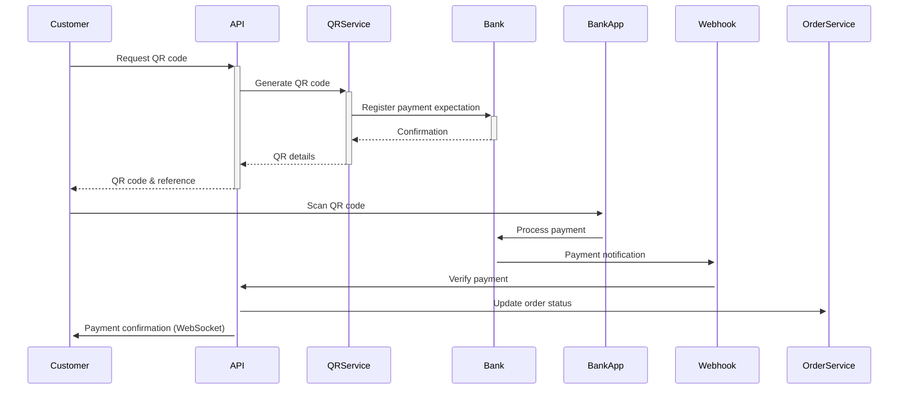
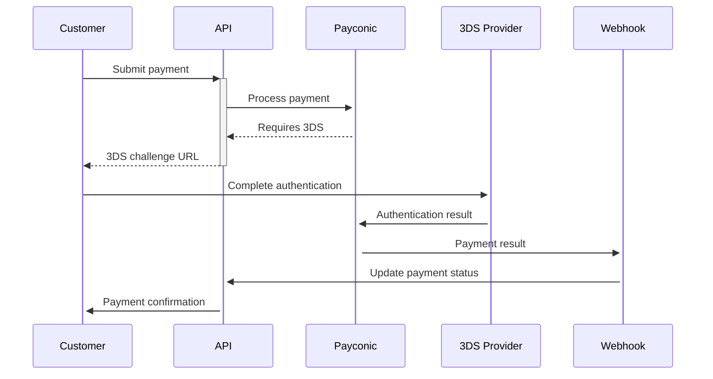
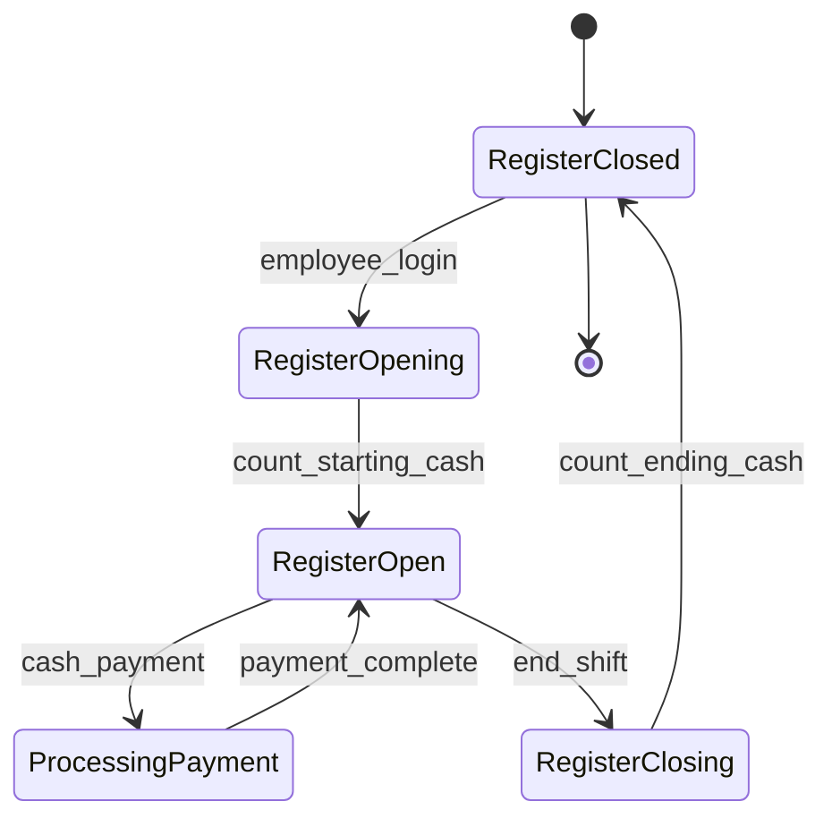
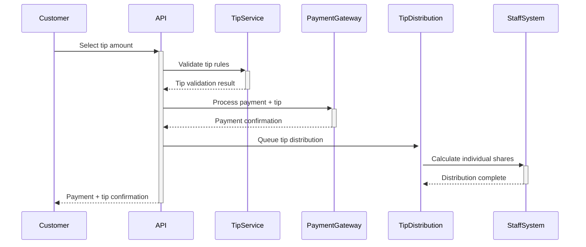

# Payment Gateway Integration Specifications

## Overview

This document details the integration specifications for all payment methods supported by the Restaurant Ordering System, including QR code generation for bank transfers, Payconic payment gateway, cash handling workflows, and customer credit systems.

## 1. QR Code Payment System

### 1.1 Technical Requirements

#### QR Code Generation
```typescript
interface QRCodePayment {
  orderId: string;
  amount: number;
  currency: 'EUR';
  reference: string;           // Belgian structured communication
  bankAccount: string;         // IBAN format
  beneficiary: string;         // Merchant name
  expiresAt: Date;
  qrCodeData: string;         // QR code content
  qrCodeImage: string;        // Base64 encoded PNG
}
```

#### Belgian Structured Communication Format
```typescript
// Format: +++123/4567/89012+++
const generateStructuredRef = (orderId: string): string => {
  // Take last 10 digits of order UUID
  const baseNumber = orderId.replace(/\D/g, '').slice(-10);
  const checksum = calculateMod97(baseNumber);
  return `+++${baseNumber.slice(0,3)}/${baseNumber.slice(3,7)}/${baseNumber.slice(7)}${checksum.toString().padStart(2, '0')}+++`;
};
```

#### QR Code Content Structure
```
BCD
002
1
SCT
{BIC}
{Beneficiary Name}
{IBAN}
EUR{Amount}


{Structured Reference}
```

### 1.2 Implementation Specifications

#### API Endpoint: POST /payments/qr-code
```typescript
// Request
interface QRCodeRequest {
  orderId: string;
  amount: number;
  currency: 'EUR';
  expiryMinutes?: number; // Default: 15
}

// Response
interface QRCodeResponse {
  qrCode: string;           // Base64 PNG image
  qrData: string;           // Raw QR content
  paymentReference: string; // Structured communication
  bankDetails: {
    iban: string;
    bic: string;
    beneficiary: string;
  };
  expiresAt: string;        // ISO 8601 timestamp
  verificationUrl: string;  // Webhook for payment confirmation
}
```

#### Payment Verification Workflow


#### Bank Integration Specifications

**Webhook Payload (from bank)**
```json
{
  "transactionId": "TXN123456789",
  "amount": "15.50",
  "currency": "EUR",
  "reference": "+++123/4567/89012+++",
  "status": "completed",
  "timestamp": "2024-01-15T10:30:00Z",
  "debtor": {
    "name": "John Doe",
    "iban": "BE68539007547034"
  },
  "creditor": {
    "name": "Table Tap BVBA",
    "iban": "BE12345678901234"
  }
}
```

### 1.3 Error Handling

```typescript
enum QRCodeError {
  INVALID_AMOUNT = 'INVALID_AMOUNT',
  ORDER_NOT_FOUND = 'ORDER_NOT_FOUND',
  PAYMENT_ALREADY_PROCESSED = 'PAYMENT_ALREADY_PROCESSED',
  QR_GENERATION_FAILED = 'QR_GENERATION_FAILED',
  BANK_INTEGRATION_ERROR = 'BANK_INTEGRATION_ERROR'
}
```

## 2. Payconic Payment Gateway Integration

### 2.1 Authentication & Configuration

```typescript
interface PayconicConfig {
  merchantId: string;
  apiKey: string;
  secretKey: string;
  baseUrl: string;           // https://api.payconic.com/v1
  webhookSecret: string;
  environment: 'sandbox' | 'production';
}
```

### 2.2 Payment Processing Flow

#### Card Payment Request
```typescript
interface PayconicPaymentRequest {
  amount: number;
  currency: 'EUR';
  orderId: string;
  customer: {
    email?: string;
    name?: string;
  };
  paymentMethod: {
    type: 'card' | 'saved_card';
    card?: {
      number: string;
      expiryMonth: string;
      expiryYear: string;
      cvv: string;
      holderName: string;
    };
    token?: string; // For saved cards
  };
  returnUrl: string;
  webhookUrl: string;
  metadata: {
    cafeId: string;
    tableNumber?: number;
    employeeId?: string;
  };
}
```

#### 3DS Authentication Flow


### 2.3 Payconic API Integration

#### Payment Creation
```http
POST https://api.payconic.com/v1/payments
Authorization: Bearer {apiKey}
Content-Type: application/json

{
  "amount": 1550,
  "currency": "EUR",
  "reference": "ORD-001234",
  "customer": {
    "email": "customer@example.com"
  },
  "payment_method": {
    "type": "card",
    "card": {
      "number": "4111111111111111",
      "exp_month": "12",
      "exp_year": "2025",
      "cvc": "123",
      "name": "John Doe"
    }
  },
  "confirmation_method": "automatic",
  "return_url": "https://app.table-tap.com/payment/success",
  "metadata": {
    "order_id": "order_uuid",
    "cafe_id": "cafe_uuid"
  }
}
```

#### Payment Response
```json
{
  "id": "pay_123456789",
  "status": "requires_action",
  "amount": 1550,
  "currency": "eur",
  "next_action": {
    "type": "redirect_to_url",
    "redirect": {
      "url": "https://hooks.payconic.com/3ds/pay_123456789"
    }
  },
  "client_secret": "pay_123456789_secret_abc"
}
```

### 2.4 Webhook Handling

```typescript
interface PayconicWebhook {
  id: string;
  type: 'payment.succeeded' | 'payment.failed' | 'payment.requires_action';
  data: {
    object: PayconicPayment;
  };
  created: number;
  request?: string;
}

// Webhook signature verification
const verifyWebhookSignature = (
  payload: string,
  signature: string,
  secret: string
): boolean => {
  const computedSignature = crypto
    .createHmac('sha256', secret)
    .update(payload)
    .digest('hex');

  return crypto.timingSafeEqual(
    Buffer.from(signature),
    Buffer.from(computedSignature)
  );
};
```

## 3. Cash Payment System

### 3.1 Cash Register Integration

```typescript
interface CashRegisterSession {
  employeeId: string;
  registerId: string;
  startingCash: number;
  currentCash: number;
  transactions: CashTransaction[];
  startTime: Date;
  endTime?: Date;
}

interface CashTransaction {
  orderId: string;
  amount: number;
  amountReceived: number;
  change: number;
  timestamp: Date;
  employeeId: string;
  receiptNumber: string;
}
```

### 3.2 Cash Handling Workflow



### 3.3 Cash Payment Processing

```typescript
// API Endpoint: POST /payments/cash
interface CashPaymentRequest {
  orderId: string;
  amountReceived: number;
  employeeId: string;
  registerId: string;
}

interface CashPaymentResponse {
  transactionId: string;
  changeAmount: number;
  receiptNumber: string;
  cashRegisterBalance: number;
}

// Cash reconciliation
interface CashReconciliation {
  employeeId: string;
  registerId: string;
  expectedCash: number;
  countedCash: number;
  variance: number;
  transactions: CashTransaction[];
  startTime: Date;
  endTime: Date;
}
```

## 4. Customer Credit System

### 4.1 Credit Account Management

```typescript
interface CustomerCredit {
  customerId: string;
  balance: number;
  currency: 'EUR';
  transactions: CreditTransaction[];
  expiryPolicy: {
    enabled: boolean;
    days: number;
  };
  limits: {
    maxBalance: number;
    maxTopUp: number;
  };
}

interface CreditTransaction {
  id: string;
  type: 'topup' | 'payment' | 'refund' | 'expiry' | 'adjustment';
  amount: number;
  description: string;
  orderId?: string;
  timestamp: Date;
  expiresAt?: Date;
}
```

### 4.2 Credit Payment Processing

```typescript
// Credit payment with fallback
interface CreditPaymentRequest {
  customerId: string;
  orderId: string;
  amount: number;
  fallbackPayment?: {
    method: 'card' | 'qr';
    paymentDetails: any;
  };
}

interface CreditPaymentResponse {
  transactionId: string;
  creditUsed: number;
  remainingCredit: number;
  fallbackRequired: boolean;
  fallbackAmount?: number;
  fallbackTransactionId?: string;
}
```

### 4.3 Credit Top-up Integration

```typescript
// Top-up via any payment method
const processCreditTopup = async (
  customerId: string,
  amount: number,
  paymentMethod: 'card' | 'qr' | 'cash'
): Promise<CreditTopupResult> => {
  // Validate top-up limits
  const customer = await getCustomer(customerId);
  if (customer.creditBalance + amount > customer.limits.maxBalance) {
    throw new Error('CREDIT_LIMIT_EXCEEDED');
  }

  // Process payment via selected method
  const paymentResult = await processPayment(amount, paymentMethod);

  if (paymentResult.success) {
    // Add credit to customer account
    await addCredit(customerId, amount, paymentResult.transactionId);
    return { success: true, newBalance: customer.creditBalance + amount };
  }

  return { success: false, error: paymentResult.error };
};
```

## 5. Tip Configuration System

### 5.1 Cafe-specific Tip Settings

```typescript
interface TipConfiguration {
  cafeId: string;
  enabled: boolean;
  presetPercentages: number[];    // [5, 10, 15, 20]
  customTipAllowed: boolean;
  minimumTip: number;
  maximumTip: number;
  defaultPercentage?: number;
  distribution: {
    method: 'equal' | 'weighted' | 'role_based';
    rules: TipDistributionRule[];
  };
}

interface TipDistributionRule {
  role: string;
  percentage: number;
  minimumHours?: number;
}
```

### 5.2 Tip Processing Workflow



### 5.3 Tip Distribution Logic

```typescript
const distributeTips = async (
  cafeId: string,
  tipAmount: number,
  workingEmployees: Employee[],
  distribution: TipConfiguration['distribution']
): Promise<TipDistribution[]> => {
  switch (distribution.method) {
    case 'equal':
      const equalShare = tipAmount / workingEmployees.length;
      return workingEmployees.map(emp => ({
        employeeId: emp.id,
        amount: equalShare,
        method: 'equal'
      }));

    case 'weighted':
      // Based on hours worked during shift
      const totalHours = workingEmployees.reduce((sum, emp) => sum + emp.hoursWorked, 0);
      return workingEmployees.map(emp => ({
        employeeId: emp.id,
        amount: (tipAmount * emp.hoursWorked) / totalHours,
        method: 'weighted'
      }));

    case 'role_based':
      // Based on role percentages
      return calculateRoleBasedTips(tipAmount, workingEmployees, distribution.rules);
  }
};
```

## 6. Transaction Logging & Audit Trail

### 6.1 Transaction Record Structure

```typescript
interface TransactionRecord {
  id: string;
  orderId: string;
  customerId?: string;
  employeeId?: string;
  type: 'payment' | 'refund' | 'tip' | 'credit_topup' | 'credit_payment';
  method: 'card' | 'cash' | 'qr' | 'credit';
  amount: number;
  currency: 'EUR';
  status: 'pending' | 'completed' | 'failed' | 'cancelled';

  // Gateway-specific data
  gatewayTransactionId?: string;
  gatewayResponse?: any;

  // Metadata
  metadata: {
    cafeId: string;
    counterId?: string;
    deviceId?: string;
    ipAddress?: string;
    userAgent?: string;
  };

  // Timestamps
  createdAt: Date;
  updatedAt: Date;
  completedAt?: Date;

  // Audit fields
  createdBy: string;
  lastModifiedBy?: string;
}
```

### 6.2 Audit Requirements

#### Financial Compliance
- All transactions logged with immutable timestamps
- Digital signatures for transaction integrity
- Backup to separate audit database every hour
- 7-year retention period for financial records
- Real-time fraud detection monitoring

#### Security Audit Trail
```typescript
interface SecurityAuditLog {
  timestamp: Date;
  userId: string;
  userType: 'customer' | 'employee' | 'manager' | 'admin';
  action: string;
  resource: string;
  outcome: 'success' | 'failure';
  ipAddress: string;
  deviceId: string;
  details: any;
  riskScore: number;    // 0-100 fraud risk assessment
}
```

## 7. Error Handling & Recovery

### 7.1 Payment Gateway Failover

```typescript
interface PaymentGatewayFailover {
  primary: 'payconic';
  secondary: 'stripe';     // Backup gateway
  fallback: 'manual';      // Manual processing

  failoverRules: {
    timeoutSeconds: 30;
    maxRetries: 3;
    backoffMultiplier: 2;
  };
}

// Implementation
const processPaymentWithFailover = async (
  paymentRequest: PaymentRequest
): Promise<PaymentResult> => {
  try {
    // Try primary gateway (Payconic)
    return await payconic.processPayment(paymentRequest);
  } catch (error) {
    console.error('Primary gateway failed:', error);

    try {
      // Try secondary gateway
      return await stripe.processPayment(paymentRequest);
    } catch (secondaryError) {
      // Fallback to manual processing
      return await queueManualProcessing(paymentRequest);
    }
  }
};
```

### 7.2 Network Resilience

```typescript
// Offline payment queuing for cash/credit
interface OfflinePaymentQueue {
  payments: PendingPayment[];
  syncOnReconnection: boolean;
  maxOfflineTime: number;    // 4 hours
  autoRetry: boolean;
}

// Payment reconciliation after network recovery
const reconcileOfflinePayments = async (): Promise<void> => {
  const pendingPayments = await getOfflinePayments();

  for (const payment of pendingPayments) {
    try {
      await syncPaymentWithGateway(payment);
    } catch (error) {
      await queueForManualReview(payment, error);
    }
  }
};
```

## 8. Performance & Monitoring

### 8.1 SLA Requirements

| Payment Method | Response Time SLA | Availability SLA | Success Rate SLA |
|---------------|-------------------|------------------|------------------|
| QR Code | < 2 seconds | 99.9% | 99.5% |
| Payconic Card | < 5 seconds | 99.5% | 98.0% |
| Cash | < 1 second | N/A | 100% |
| Credit | < 500ms | 99.9% | 99.8% |

### 8.2 Monitoring Metrics

```typescript
interface PaymentMetrics {
  totalTransactions: number;
  successfulTransactions: number;
  failedTransactions: number;
  averageProcessingTime: number;

  byMethod: {
    [method: string]: {
      count: number;
      successRate: number;
      averageTime: number;
      revenue: number;
    };
  };

  errors: {
    [errorCode: string]: number;
  };

  // Real-time alerts
  alerts: {
    highFailureRate: boolean;
    slowProcessing: boolean;
    gatewayDown: boolean;
  };
}
```

This comprehensive payment integration specification ensures secure, reliable, and compliant payment processing across all supported methods while maintaining excellent user experience and operational efficiency.